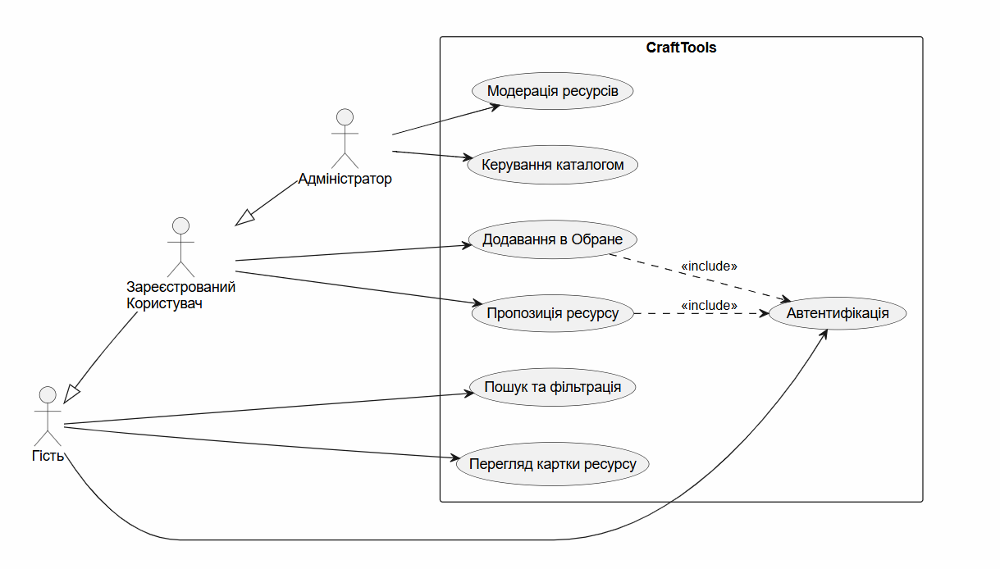
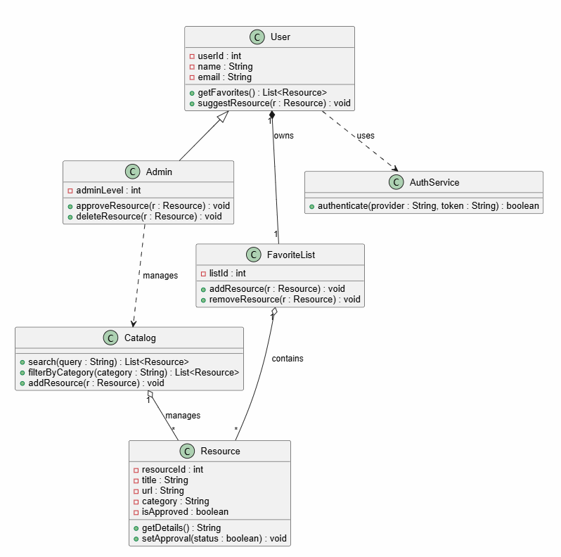
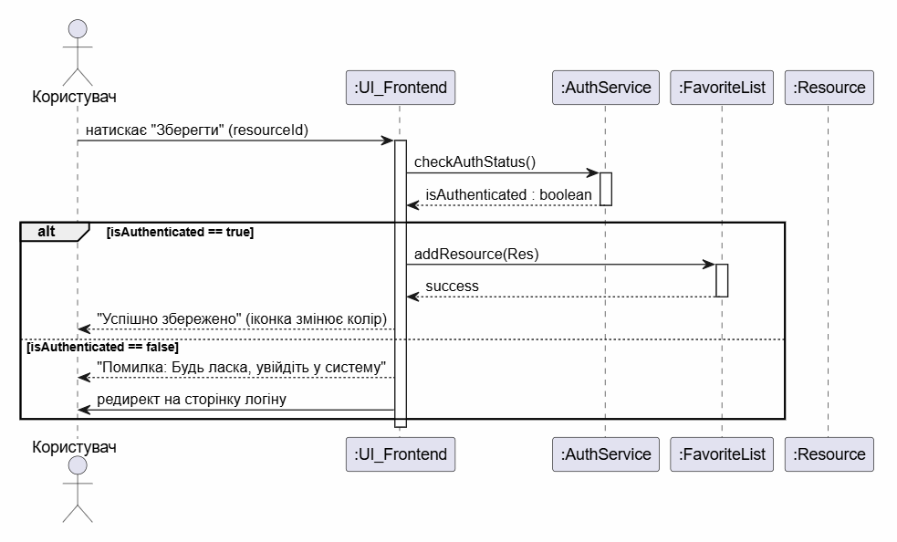

## Перелік функціональних вимог (FR)

| ID | Функціональна вимога | Пріоритет |
| :--- | :--- | :--- |
| **FR-01** | Система має дозволяти користувачу здійснювати пошук інструментів за назвою через пошуковий рядок. | Високий |
| **FR-02** | Система має фільтрувати ресурси за категоріями (Design, Dev, Productivity). | Високий |
| **FR-03** | Система має забезпечувати авторизацію користувачів через сторонні сервіси (Google/GitHub). | Високий |
| **FR-04** | Система має дозволяти авторизованому користувачу додавати інструменти в особистий список «Обране». | Середній |
| **FR-05** | Система має дозволяти авторизованому користувачу пропонувати нові ресурси через спеціальну форму. | Середній |
| **FR-06** | Система має надавати адміністратору інтерфейс для модерації (схвалення або відхилення) запропонованих посилань. | Високий |
| **FR-07** | Система має відображати детальну картку ресурсу з текстовим описом та автоматичним прев’ю (скриншотом). | Високий |

## Діаграма прецедентів

## Діаграма класів

## Діаграма послідовності

### Таблиця трасовності

| Вимога | Use Case | Класи | Sequence |
| :--- | :--- | :--- | :--- | :--- |
| **FR-01** | UC01 | `Catalog`, `Resource` | — |
| **FR-02** | UC01 | `Catalog`, `Resource` | — |
| **FR-03** | UC03 | `User`, `AuthService` | SD-01 |
| **FR-04** | UC04 | `User`, `FavoriteList`, `Resource`, `AuthService` | SD-01 |
| **FR-05** | UC05 | `User`, `Resource` | — |
| **FR-06** | UC06 | `Admin`, `Resource`, `Catalog` | — |
| **FR-07** | UC02 | `Resource` | — |
